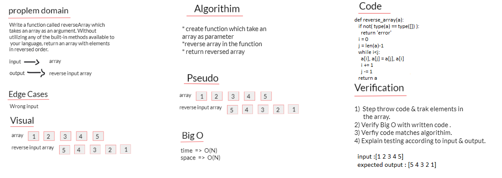

# Reverse an Array

<!-- Description of the challenge -->

### Feature Tasks

Write a function called reverseArray which takes an array as an argument. Without utilizing any of the built-in methods available to your language, return an array with elements in reversed order.

## Whiteboard Process

<!-- Embedded whiteboard image -->

## Approach & Efficiency

<!-- What approach did you take? Discuss Why. What is the Big O space/time for this approach? -->

big_O is a Python module to estimate the time complexity of Python code from its execution time. It can be used to analyze how functions scale with inputs of increasing size. big_O executes a Python function for input of increasing size N , and measures its execution time.
