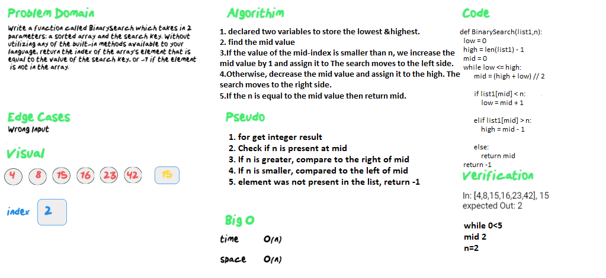

# Binary Search

<!-- Description of the challenge -->

### Feature Tasks

Write a function called BinarySearch which takes in 2 parameters: a sorted array and the search key. Without utilizing any of the built-in methods available to your language, return the index of the array’s element that is equal to the value of the search key, or -1 if the element is not in the array.

## Whiteboard Process

<!-- Embedded whiteboard image -->

## Approach & Efficiency

<!-- What approach did you take? Discuss Why. What is the Big O space/time for this approach? -->

big_O is a Python module to estimate the time complexity of Python code from its execution time. It can be used to analyze how functions scale with inputs of increasing size. big_O executes a Python function for input of increasing size N , and measures its execution time.
